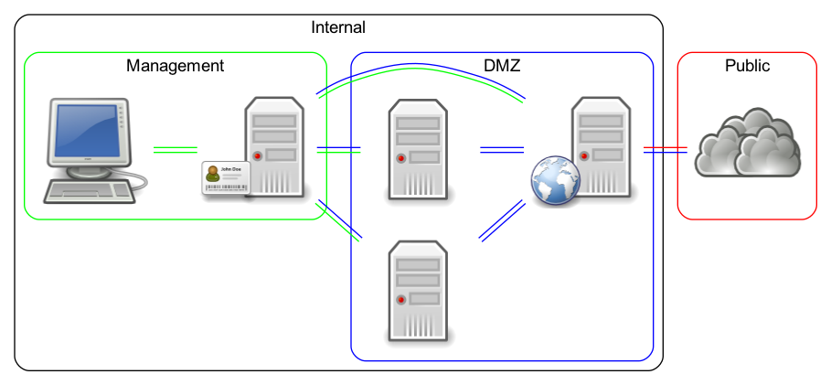

# Building a bastion, or an example on how to lock down a website using Ansible and Docker


This lab uses [Vagrant](https://www.vagrantup.com/) to create four
[Ubuntu](https://ubuntu.com/) servers in a test
environment, deploy the configuation and services with [Ansible](https://www.ansible.com/)
and [Docker](https://www.docker.com/) as a service manager.

The [Vagrantfile](./Vagrantfile) contains the configuration of four servers;
one bastion host, one loadbalancer using [HAProxy](https://www.haproxy.org/)
and two webservers running [NGINX](https://www.nginx.com/).

## General overview and guidance

Software based firewalls on all servers, restricting access
between all services and servers.

The firewalls placed on each server should allow access from the bastion
host for Ansible administration and only to and from required services.

Software based firewalls should be used in conjunction with perimeter firewalls,
placed between all general zones, e.g the DMZ, Public and Internal networks.

> Network location alone should not imply trust.

### Placement and connections

The manager node is placed on a internal network, the bastion host is connected
to the internal network but also to the network with the webservers and
loadbalancer.

Using `ufw`, in addition to placing the servers on separate networks, we
reject all network traffic not explicitly allowed, and only to and from the
required services.

- Manager node (internal network)
- Bastion host (internal network/DMZ)
- Webservers and HAProxy (DMZ)



## Usage

```sh
vagrant up
bash ./generate_bastion_host_file.sh
ansible-playbook -i hosts all.yml
```

`vagrant up` creates the servers.

`generate_bastion_host_file.sh` will generate the Ansible `hosts` file, group
configuration and insert the same Vagrant public key on all servers. The script
will also add the Vagrant private key to the SSH authentication agent using
`ssh-add`.

`ansible-playbook -i hosts all.yml` will run the `all.yml` Ansible playbook.

Visit `https://127.0.0.1` after the playbook finishes, and since we're using
self-signed certificates, ignore the certificate warning. Reload the page a
couple of times to verify that the loadbalancer is working.

## Ansible details

### Using a bastion host

Example `hosts` file:

```ini
[bastion]
bastion01 ansible_host=192.168.0.45 ansible_user=vagrant

[internal]
loadbalancer01 ansible_host=10.2.3.43 ansible_user=vagrant
webserver01 ansible_host=10.2.3.41 ansible_user=vagrant
webserver02 ansible_host=10.2.3.42 ansible_user=vagrant

[loadbalancer]
loadbalancer01 ansible_host=10.2.3.43 ansible_user=vagrant

[webserver]
webserver01 ansible_host=10.2.3.41 ansible_user=vagrant
webserver02 ansible_host=10.2.3.42 ansible_user=vagrant
```

`group_vars/internal.yml` using the above `hosts` file:

```yaml
---
ansible_ssh_common_args: '-o ProxyCommand="ssh -A -W %h:%p vagrant@192.168.0.45"'
...
```

`group_vars/bastion.yml` with `sshd` specific configuration options:

```yaml
---
ansible_ssh_common_args: '-o ControlMaster=auto -o ControlPersist=60s'
sshd_allow_agent_forwarding: 'yes'
sshd_allow_tcp_forwarding: 'yes'
sshd_max_sessions: 10
...
```

The `sshd_*` configuration options are specific to the [konstruktoid.hardening](https://github.com/konstruktoid/ansible-role-hardening)
role.

### Automatically accepting `ssh` host keys

Below is an example on how to accept all `ssh` host keys in order to reduce any
disruption and manual workload when hosts are added or reinstalled.

> This is an example and in a production enviroment host keys should be validated in a secure manner.

```yaml
- hosts: bastion
  serial: 1
  any_errors_fatal: true
  tasks:
    - name: ssh keyscan bastion hosts from localhost
      delegate_to: localhost
      lineinfile:
        dest: ~/.ssh/known_hosts
        create: 'yes'
        state: present
        mode: '0600'
        line: "{{ lookup('pipe', 'ssh-keyscan -H' + ' ' + hostvars[item]['ansible_host']) }}"
      with_items:
        - "{{ groups['bastion'] }}"

    - name: ssh keyscan internal hosts from localhost
      delegate_to: localhost
      lineinfile:
        dest: ~/.ssh/known_hosts
        create: 'yes'
        state: present
        mode: '0600'
        line: "{{ lookup('pipe', 'ssh-keyscan -H' + ' ' + hostvars[item]['ansible_host']) }}"
      ignore_errors: true
      with_items:
        - "{{ groups['internal']|reverse|list }} "

    - name: ssh keyscan internal hosts from bastion01
      delegate_to: bastion01
      lineinfile:
        dest: ~/.ssh/known_hosts
        create: 'yes'
        state: present
        mode: '0600'
        line: "{{ lookup('pipe', 'ssh-keyscan -H' + ' ' + hostvars[item]['ansible_host']) }}"
      ignore_errors: true
      with_items:
        - "{{ groups['internal']|reverse|list }} "
```

### Reducing systematic failures using the `serial` keyword

The `strategy: free` option enables Ansible to execute tasks without waiting for
all hosts.

We also use the [serial](https://docs.ansible.com/ansible/latest/user_guide/playbooks_strategies.html#setting-the-batch-size-with-serial)
keyword to ensure the playbook runs without any issues on a small number of
hosts before moving to larger batches.

`max_fail_percentage` will ensure to abort the run after a given percentage of
hosts has failed.

```yaml
- hosts: webserver
  strategy: free
  serial:
    - 1
    - 5
    - "20%"
  max_fail_percentage: 10
```

### Docker container configuration

On all Docker containers we'll reduce the number of permitted container
capabilities and set a soft and hard limit on the number of open files.

We also mount configuration and website volumes read only.

```yaml
- name: nginx container
  become: 'yes'
  docker_container:
    name: nginx
    image: konstruktoid/nginx
    state: started
    restart: 'yes'
    ports:
      - "{{ nginx_bind_port }}:{{ nginx_bind_port }}"
    cap_drop: all
    capabilities:
      - chown
      - dac_override
      - net_bind_service
      - setgid
      - setuid
    ulimits:
      - nofile:8032:16064
    volumes:
      - /etc/nginx/:/etc/nginx/:ro
      - /var/www/{{ ansible_hostname }}:/var/www/{{ ansible_hostname }}:ro
      - /var/log/nginx/:/var/log/nginx/
    pull: 'yes'
    restart_policy: on-failure
    restart_retries: 3
    hostname: "{{ ansible_nodename }}"
```

## Discussion and documents: Risks and areas of attention

### Account management

[CIS Control 16 - Account Monitoring and Control](https://www.cisecurity.org/controls/account-monitoring-and-control/)

[NIST Special Publication 800-53 (Rev. 4): AC-2 ACCOUNT MANAGEMENT](https://nvd.nist.gov/800-53/Rev4/control/AC-2)

### Server and service hardening

[Center for Internet Security Linux Benchmarks](https://www.cisecurity.org/cis-benchmarks/)

[Docker security](https://docs.docker.com/engine/security/)

[OSA SP-023: Industrial Control Systems](http://www.opensecurityarchitecture.org/cms/library/patternlandscape/293-sp-023-industrial-control-systems)

[OSA SP-026: PCI Full Environment](http://www.opensecurityarchitecture.org/cms/library/patternlandscape/315-sp-026-pci-full)

[Security focused systemd configuration](https://github.com/konstruktoid/hardening/blob/master/systemd.adoc)

### SSH key management and auditing

[Enforcing SSH key policies using Ansible](https://medium.com/@konstruktoid/enforcing-ssh-key-policies-using-ansible-dedcdea5d46e)

[NISTIR 7966 Security of Interactive and Automated Access Management Using Secure Shell (SSH)](https://nvlpubs.nist.gov/nistpubs/ir/2015/NIST.IR.7966.pdf)

## Structure

```sh
.
├── README.md
├── Vagrantfile
├── all.yml
├── generate_bastion_host_file.sh
├── group_vars
│   ├── bastion.yml
│   └── internal.yml
├── hosts
├── images
│   ├── bastion_map.dot
│   ├── bastion_map.png
│   ├── osa_cloud.png
│   ├── osa_desktop.png
│   ├── osa_server.png
│   ├── osa_server_identity.png
│   └── osa_server_web.png
└── roles
    ├── docker
    │   ├── defaults
    │   │   └── main.yml
    │   ├── handlers
    │   │   └── main.yml
    │   ├── tasks
    │   │   ├── audit.yml
    │   │   ├── docker_install.yml
    │   │   ├── docker_python.yml
    │   │   ├── docker_service.yml
    │   │   ├── main.yml
    │   │   └── ufw.yml
    │   └── templates
    │       ├── audit.rules.j2
    │       ├── docker.repo.j2
    │       └── docker.service.j2
    ├── haproxy
    │   ├── defaults
    │   │   └── main.yml
    │   ├── tasks
    │   │   ├── haproxy.yml
    │   │   ├── main.yml
    │   │   └── ufw.yml
    │   └── templates
    │       ├── haproxy.cfg.j2
    │       └── haproxy.pem.j2
    └── nginx
        ├── defaults
        │   └── main.yml
        ├── tasks
        │   ├── main.yml
        │   ├── nginx.yml
        │   └── ufw.yml
        └── templates
            ├── default.conf.j2
            ├── index.html.j2
            └── nginx.conf.j2

16 directories, 38 files
```

## Contributing

Do you want to contribute? Great! Contributions are always welcome,
no matter how large or small. If you found something odd, feel free to submit a
issue, improve the code by creating a pull request, or by
[sponsoring this project](https://github.com/sponsors/konstruktoid).
