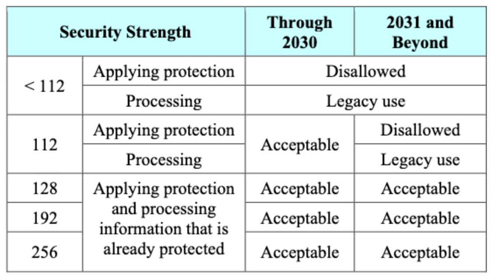

# Enforcing SSH key policies using Ansible

Information security starts with who is given access to systems and data, and
when it comes to accessing GNU/Linux or UNIX systems, that usually involves
SSH (Secure Shell).

> While most organizations have a password policy regarding length, reuse and
rotation, managing remote access SSH keys seems to be far less common.

According to [SSH Communications Security, Inc](https://www.ssh.com/iam/ssh-key-management/#insight-from-real-customer-cases)
most organizations:

- Have extremely large numbers of SSH keys - even several million - and their use is grossly underestimated
- Have no provisioning and termination processes in place for key based access
- Have no records of who provisioned each key and for what purpose
- Allow their system administrators to self-provision permanent key-based access without policies, processes, or oversight.

Also, many keys are unused and represent access that was never properly
terminated, even though these keys are like passwords; they grant access to
resources.

In this article I'll go step-by-step how to implement a basic [Ansible](https://www.ansible.com/)
playbook that enforces set rules regarding SSH key length and age.

Note that managing SSH keys on servers does not guarantee proper key, password
generation or key management by a user.

You also need to be familiar with shell scripts, Ansible administration, have
Ansible configured, and know how to write and deploy playbooks.

Please refer to the [Ansible documentation](https://docs.ansible.com/) for
details.

## The baseline: defining minimum security levels

Before we start writing any tasks, we need to set an acceptable security
baseline when it comes to the SSH keys present on a server.

Finding various recommendations and guidelines isn't very hard, and when we
browse the [National Institute of Standards and Technology (NIST)](https://www.nist.gov/publications)
publication database, as we often do, we come across
[NIST Special Publication 800-57 Part 1 Revision 5, Recommendation for Key Management: Part 1 – General](https://nvlpubs.nist.gov/nistpubs/SpecialPublications/NIST.SP.800-57pt1r5.pdf).

In that document we find the following tables:




We will assume that the operational lifetime of a server, either hardware or
operating system, is 5 years and then decommissioned and possibly replaced.

Based on the above tables, we'll then aim for a minimum of 128 bit security
strength, which means that we will enforce RSA or DSA keys equal or larger than
3072 bits and ECDSA or ED25519 keys equal or larger than 256 bits.

### The rules: what to enforce

Lets define the term `user` as any account on the system that is not a system
account or the `root` user account, so following the [Linux Standard Base Core Specification](https://refspecs.linuxfoundation.org/LSB_5.0.0/LSB-Core-generic/LSB-Core-generic/uidrange.html)
we will assume that every account with a user ID greater or equal to 500 falls
into this category.

- Users owning DSA or RSA keys with a key size less than 3072 bits will be
  locked.
- Users owning ED25519 or ECSDA keys with a key size less than 256 bits will be
  locked.
- Users owning keys older than 90 days will be locked.
- We will also enforce strict permission settings, allowing only
  `0600/-rw-------` on the affected files.

We are excluding the `root` user since the possible impact on the system if the
permissions on files required for `sshd` is modified.

We also  assume security best practices are followed, and these states that the
`root` user should never be allowed to login over `ssh` or used at all unless
necessary, see for example the [CIS Ubuntu Linux 18.04 LTS Benchmark](https://www.cisecurity.org/benchmark/ubuntu_linux/)
and [Canonical Ubuntu 18.04 LTS STIG - Ver 1, Rel 1](https://stigviewer.com/stig/canonical_ubuntu_18.04_lts/).

## The SSH keys: using local facts

As [I've written earlier](https://medium.com/@konstruktoid/using-ansible-custom-or-local-facts-95f3a8510fae),
local facts are a way to expand the information gathered by Ansible about the
managed host, and as long as the output is in valid `JSON` or `INI` format we
can use Ansible to act upon that information.

The following shell script will find common OpenSSH related files and then
output the information in `JSON`.

Note that this script doesn't take any local configuration changes into
consideration.

```
#!/bin/sh
set -u

ssh_keys() {
  HOST="$(hostname -s)"
  TMPFILE="$(mktemp)"
  I=0

  {
    echo "{ \"keys\": {"
    find -L /etc/ssh /home/*/.ssh /root /Users/*/.ssh \( -name '*.pub' -o -name 'authorized_keys*' \) -type f 2>/dev/null |\
      while read -r SSHFILE; do
        grep -vE '^#|^$' "${SSHFILE}" | while read -r SSHKEY; do
          KEYINFO="$(echo "${SSHKEY}" | ssh-keygen -lf -)"
          KEYSTAT="$(stat -c "%Y %U %G %u %g %a" "${SSHFILE}")"
          KEYFILE="\"file\" : \"${SSHFILE}\""
          KEYSIZE="\"size\" : $(echo "${KEYINFO}" | awk '{print $1}')"
          KEYHASH="\"hash\" : \"$(echo "${KEYINFO}" | awk '{print $2}')\""
          KEYTYPE="\"type\" : \"$(echo "${KEYINFO}" | awk '{print $NF}' | tr -d '()')\""
          KEYCOMMENT="\"comment\" : \"$(echo "${KEYINFO}" | awk '{$1=$2=$NF="";print}' | sed -e "s/^ *//" -e "s/ *$//")\""
          FILEMODEPOCH="\"modified_epoch\" : $(echo "${KEYSTAT}" | awk '{print $1}')"
          FILEMODHUMAN="\"modified_human\" : \"$(stat -c "%y" "${SSHFILE}")\""
          FILEOWNERNAME="\"user_name\" : \"$(echo "${KEYSTAT}" | awk '{print $2}')\""
          FILEGROUPNAME="\"group_name\" : \"$(echo "${KEYSTAT}" | awk '{print $3}')\""
          FILEOWNERID="\"user_id\" : $(echo "${KEYSTAT}" | awk '{print $4}')"
          FILEGROUPID="\"group_id\" : $(echo "${KEYSTAT}" | awk '{print $5}')"
          FILEPERM="\"permissions\": $(echo "${KEYSTAT}" | awk '{print $6}')"
          echo "\"${HOST}_${I}\": { ${KEYFILE}, ${KEYSIZE}, ${KEYHASH}, ${KEYCOMMENT}, ${KEYTYPE}, ${FILEMODEPOCH}, ${FILEMODHUMAN}, ${FILEOWNERNAME}, ${FILEGROUPNAME}, ${FILEOWNERID}, ${FILEGROUPID}, ${FILEPERM} },"
        done
        I=$((I + 1))
    done
    echo "} }"
  } > "${TMPFILE}"

  grep -v '^#' "${TMPFILE}" | tr  '\n' ' ' | sed 's/ }, } }/ } } }/g'
  rm "${TMPFILE}"
}

ssh_keys
```

Running the script on a [Ubuntu Groovy 20.04](https://ubuntu.com/server) [Vagrant](https://www.vagrantup.com/)
server will result in something similar to the following.

```json
{ "keys": { "groovy_0": { "file" : "/etc/ssh/ssh_host_ed25519_key.pub", "size" : 256, "hash" : "SHA256:s/kzeMRTIbL9Rbzd/Qyy1uGIB+ahXOLUmnn8Xfi7g8A", "comment" : "root@ubuntu-groovy", "type" : "ED25519", "modified_epoch" : 1594282419, "modified_human" : "2020-07-09 08:13:39.551999855 +0000", "user_name" : "root", "group_name" : "root", "user_id" : 0, "group_id" : 0, "permissions": 644 }, "groovy_1": { "file" : "/etc/ssh/ssh_host_rsa_key.pub", "size" : 3072, "hash" : "SHA256:WAZE2RPIQsuxbQ2UTJWLWrbaIW+RDaOFBZclMV4GeDs", "comment" : "root@ubuntu-groovy", "type" : "RSA", "modified_epoch" : 1594282419, "modified_human" : "2020-07-09 08:13:39.395999858 +0000", "user_name" : "root", "group_name" : "root", "user_id" : 0, "group_id" : 0, "permissions": 644 }, "groovy_2": { "file" : "/etc/ssh/ssh_host_ecdsa_key.pub", "size" : 256, "hash" : "SHA256:RS8eGA0QTjKDNRONh3tIAqnLH5VZsN7i9Ventx2ekR8", "comment" : "root@ubuntu-groovy", "type" : "ECDSA", "modified_epoch" : 1594282419, "modified_human" : "2020-07-09 08:13:39.547999855 +0000", "user_name" : "root", "group_name" : "root", "user_id" : 0, "group_id" : 0, "permissions": 644 }, "groovy_3": { "file" : "/etc/ssh/ssh_host_dsa_key.pub", "size" : 1024, "hash" : "SHA256:0GxeCFHSc5Ms+HUmSaokJhbfcPylU5tAhEf41Ft59Jg", "comment" : "root@ubuntu-groovy", "type" : "DSA", "modified_epoch" : 1594282419, "modified_human" : "2020-07-09 08:13:39.539999856 +0000", "user_name" : "root", "group_name" : "root", "user_id" : 0, "group_id" : 0, "permissions": 644 }, "groovy_4": { "file" : "/home/vagrant/.ssh/authorized_keys", "size" : 2048, "hash" : "SHA256:08fGQKGJoyVZEfJ6+JLdj6o8hJuecSjtp0wZO1jWATA", "comment" : "vagrant", "type" : "RSA", "modified_epoch" : 1594282422, "modified_human" : "2020-07-09 08:13:42.839999796 +0000", "user_name" : "vagrant", "group_name" : "vagrant", "user_id" : 1000, "group_id" : 1000, "permissions": 600 } } }
```

## The tasks: converting policy to commands

After establishing an policy, written the Ansible `.fact` script and verifying
that it works, it's time to write the actual playbook.

We will be using [json_query](https://docs.ansible.com/ansible/latest/user_guide/playbooks_filters.html#json-query-filter)
to parse the script output so we will have to make sure `python3-jmespath` is
installed on the management server.

```yaml
---
- hosts: all
  become: true
  tasks:
    - name: Install python-jmespath
      become: 'yes'
      apt:
        name: python-jmespath
        state: present
        update_cache: 'yes'
      when: ansible_python.version.major <= 2

    - name: Install python3-jmespath
      become: 'yes'
      apt:
        name: python3-jmespath
        state: present
        update_cache: 'yes'
      when: ansible_python.version.major >= 3
```

We then create the Ansible facts directory in case it doesn't exist and copy the
script to that directory.

By using `setup: ~` afterwards we make Ansible gather the host information,
including our newly added SSH key facts.

```yaml
    - name: Create local facts directory
      become: 'yes'
      file:
        path: /etc/ansible/facts.d
        recurse: true
        state: directory
        mode: 0755
        owner: root
        group: root
      tags:
        - fact

    - name: Add SSH keys fact script
      become: 'yes'
      template:
        src: etc/ansible/facts.d/sshkeys.fact
        dest: /etc/ansible/facts.d/sshkeys.fact
        mode: 0755
        owner: root
        group: root
      tags:
        - sshd
        - fact

    - name: Update facts
      setup: ~
      tags:
        - fact
```

The three last tasks enforces our policy.

First we lock any users, `user_id >= 500`, with short SSH keys then users with
keys older than 90 days. All other user files found will have their permission
set to `0600/-rw-------`.

```yaml
    - name: Lock users with short SSH keys
      user:
        name: "{{ item.user_name }}"
        password_lock: 'yes'
        shell: "/bin/false"
      with_items:
        - "{{ ansible_local['sshkeys'] | json_query('keys.*') }}"
      when: item.user_id >= 500
            and ((item.type == "DSA" or item.type == "RSA") and item.size < 3072)
            or ((item.type == "ECDSA" or item.type == "ED25519") and item.size < 256)
      tags:
        - sshd

    - name: Lock users with SSH keys older than 90 days
      vars:
        - old_key: "{{ ansible_date_time.epoch|int - (86400*90) }}"
      user:
        name: "{{ item.user_name }}"
        password_lock: 'yes'
        shell: "/bin/false"
      with_items:
        - "{{ ansible_local['sshkeys'] | json_query('keys.*') }}"
      when: item.modified_epoch|int <= old_key|int and item.user_id >= 500
      tags:
        - sshd

    - name: Set SSH key file permissions
      file:
        path: "{{ item.file }}"
        mode: '600'
      with_items:
        - "{{ ansible_local['sshkeys'] | json_query('keys.*') }}"
      when: item.user_id >= 500 and item.permissions|int > 600
      tags:
        - sshd
...
```

## The result: enforcing with Ansible

After writing the `.fact` script and creating the Ansible tasks, it's time to
test.

In this example we'll create a user named Keys on a managed server and then
create a 2048 bit RSA SSH key as that user.

```
~$ sudo useradd -c "ansible test user" -d /home/keys -m -s /bin/bash keys
~$ grep keys /etc/passwd
keys:x:1002:100:ansible test user:/home/keys:/bin/bash
~$ sudo passwd keys
~$ sudo passwd -S keys
keys P 07/08/2020 1 60 7 35
~$ sudo su - keys
~$ ssh-keygen -t rsa -b 2048 -C "weak ssh key"
```

We then run the Ansible playbook on
the management server; `ansible-playbook -i hosts ssh-key-policies.yaml`.

```
changed: [X.X.X.X] => (item={'file': '/home/keys/.ssh/id_rsa.pub', 'size': 2048, 'hash': 'SHA256:qLjv5mSATfHU+z8qvaDxCvR1KZeJi2UGp4pXwMxQDGg', 'comment': 'weak ssh key', 'type': 'RSA', 'modified_epoch': 1594293187, 'modified_human': '2020-07-09 11:13:07.379265542 +0000', 'user_name': 'keys', 'group_name': 'users', 'user_id': 1002, 'group_id': 100, 'permissions': 600})
```

After the run has completed, we verify the result:

```
~$ grep keys /etc/passwd
keys:x:1002:100:ansible test user:/home/keys:/bin/false
~$ sudo passwd -S keys
keys L 07/08/2020 1 60 7 35
```

Notice how the user shell has changed to `/bin/false` and the user has been
locked.
